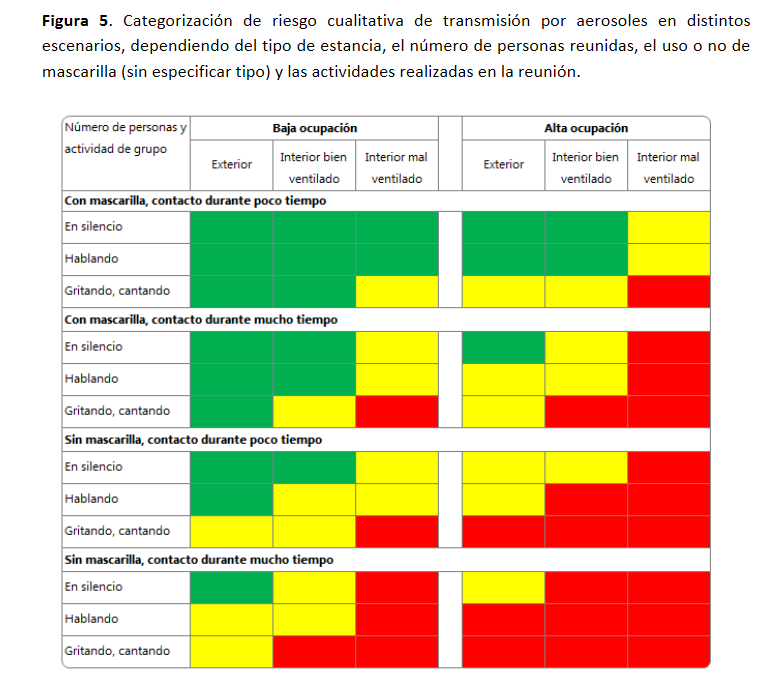
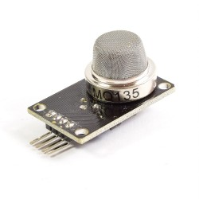
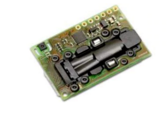

# CARBON DIOXIDE SMART METER  - GCP IOT


1. Problem
2. Objective
3. Theory and motivation of the project
4. Components
5. Cloud Google Cloud Platform
6. Software
7. Hardware
8. Connections
9. Air Quality Sensor MQ135
10. Display SSD1306
11.  Final code ESP32 carbon dioxide meter
12. Grafana Dashboard
13. Documentation 


## Problem: 

Exhaled CO2 as a proxy for COVID-19 infection risk for different indoor environments and activities
- Outdoors, CO2 concentrations are approximately 420-450ppm although it may vary from urban or rural settings. 
- Indoor,A threshold of 800-1000ppm of CO2 concentration could be established that should not be exceeded as a guarantee of good ventilation.

https://www.mscbs.gob.es/profesionales/saludPublica/ccayes/alertasActual/nCov/documentos/COVID19_Aerosoles.pdf




## Objective:

Carry out a centralized Co2 monitoring system and alert where ventilation needs to be improved.
We will use low-cost devices, C ++ programming and Google Cloud as a platform for its analysis

## Theory and motivation of the project

Carbon dioxide: It is a product of the respiration of all aerobic organisms. It returns to the waters through the gills of fish and into the air through the lungs of breathing land animals, including humans. CO2 is produced during the decomposition of organic materials and the fermentation of sugars in the manufacture of wine, beer and bread. It is also produced by the combustion of wood (firewood), carbohydrates, and fossil fuels such as coal, peat, oil, and natural gas.


### Components

### Cloud Google Cloud Platform

- Enables end-to-end security through asymmetric key authentication using TLS 1.2
- Secure connection via industry standard protocols such as MQTT and HTTP
- The service is serverless and does not require any initial software installation.
- Cloud Iot Core 
  Configuration registry
  Configuration devices with HTTP / MQTT

- Cloud Pub/Sub 
  Global data system for dispersed devices
  
- Triggers
  Google Cloud Functions to Bigquery
  email
  Slack
  open windows

- BigQuery dataset with table service


###  Cloud Function 

```
import logging
import os
import re
from google.cloud import bigquery
import base64
import json

logging.basicConfig(format='%(name)s - %(levelname)s - %(message)s', level=logging.INFO)
logger = logging.getLogger(__name__)


def processMessage(event, context):
    dataset = 'Co2office2' # '<dataset name here. e.g. test1>'
    table = 'ideas-2020-298511.Co2office2.devices' # '<fully qualified table name here. e.g. gcp-project-id.datasetName.tableName>'
    message = base64.b64decode(event['data']).decode('utf-8')
    try:
        logger.info('Message received: %s', str(message))
        # Load JSON string to dictionary
        jdata = json.loads(message)
        client = bigquery.Client()
        dataset_ref = client.dataset(dataset)
        # check if dataset exists, otherwise create
        try:
            client.get_dataset(dataset_ref)
        except Exception:
            logging.warn('Creating dataset: %s' % (dataset))
            client.create_dataset(dataset_ref)

        job_config = bigquery.LoadJobConfig()
        job_config.autodetect = True
        load_job = client.load_table_from_json([jdata], table, job_config=job_config)
        logger.info('Load job: %s [%s]' % (
            load_job.job_id,
            load_job.result()
        ))
    except Exception as e:
        logger.info('Error-unable-to-process message:%s exception:%s', str(message), e)
```

### Software

The lenguaje we will to use has C++ and Ide its will Arduino IDE

- Component C++ GCP Iot connect to Esp32     (src/gcp-iot)
- Component C++ Sensor Mq135                 (src/detector_mq135_esp32_ideasextraordinarias_read)
- Component C++ Display ssd1306              (src/ssd106_esp32_ideasextraordinarias)
- Docker contaner grafana with plugin Data Sources / Google BigQuery
  

### Hardware

- Esp32
- Sensor Mq135
- Display ssd1306
- Input 5 volt with transformer or 18650 batteries with stabilizer or USB battery for mass use.
- Imagination and ilusion


### Connections


### Air Quality Sensor MQ135

- They are used in air quality control equipment for buildings and offices, they are suitable for the detection of NH3, NOx, alcohol, benzene, smoke, CO2, etc.
- There are other types of higher quality sensors called NDIR (Non Dispersive - Infrared)

https://www.mscbs.gob.es/profesionales/saludPublica/ccayes/alertasActual/nCov/documentos/COVID19_Aerosoles.pdf  P-19





### Display SSD1306


###  Final code ESP32 carbon dioxide meter


```
#include "config/config_wifi.h"
#include <WiFi.h>  
#include <U8g2lib.h>
#include <Wire.h>
#include "esp32-mqtt.h"
#include "time.h"
U8G2_SH1106_128X64_NONAME_F_HW_I2C u8g2(U8G2_R0, U8X8_PIN_NONE);


int Buzzer = 32;        // used for ESP32
int Gas_analog = 34;    // used for ESP32
char str[8];            // variable int to string
const char* connection ;
unsigned long lastMillis = 0;
#define MQ135_THRESHOLD_1 1000 // Fresh Air threshold
#define MQ135_MIN 300 // Fresh Air threshold
WiFiClient askClient;


const char* ntpServer = "pool.ntp.org";
const long  gmtOffset_sec = 3600;
const int   daylightOffset_sec = 3600;
const char* ppm_time = "";
char resutltime[80];
char resutltimetimeHour[3];
char resutltimetimeWeekDay[10];

void setup() {
u8g2.begin(); //Init
Serial.begin(115200);
Serial.println("**********************************");
Serial.println("*****Program Start: ESP32 publishes MQ-135n ");
//initialise_wifi();
pinMode(LED_BUILTIN, OUTPUT);
setupCloudIoT();
//init and get the time
configTime(gmtOffset_sec, daylightOffset_sec, ntpServer);

}

void loop() {
  
Serial.println(WiFi.localIP());
delay(1000);
int MQ135_data = analogRead(Gas_analog); 
itoa( MQ135_data, str, 10 );

/* date */
struct tm timeinfo;
if(!getLocalTime(&timeinfo)){
    Serial.println("Failed to obtain time");
} else {
    //strftime(resutltimetimeHour,3, "%H", &timeinfo);
    strftime(resutltime, 20,"%Y-%m-%d %H:%M:%S", &timeinfo);

}
/* date */


/* Status connection */
if(WiFi.status() != WL_CONNECTED){
connection = "Connect:Off-line";  
}else{
connection = "Connect:On-line";

}
/* Status connection */

/* Alarm */
if(MQ135_data < MQ135_THRESHOLD_1){
Serial.print("Fresh Air: ");
} else {
Serial.print("Poor Air: ");
digitalWrite (Buzzer, HIGH) ; //send tone
delay(2000);
digitalWrite (Buzzer, LOW) ;  //no tone
}
/* Alarm */

if(MQ135_data <= MQ135_MIN){
Serial.println(MQ135_data);              // analog data
Serial.println(" CO2 particles PPM");    // Unit = part per million
} else {
Serial.print(MQ135_data);                // analog data
Serial.println("CO2 particles PPM");     // Unit = part per million
}

/* send data to display */
u8g2.clearBuffer();                      // clear buffer
u8g2.setFont(u8g2_font_logisoso16_tr);   // fonts
u8g2.drawStr(1,15,"CO2 particles");      // write (X,Y)
u8g2.drawStr(20,33,str);                 // write (X,Y) 
u8g2.drawStr(65,33, "PPM" );             // write (X,Y) 
u8g2.drawStr(1,52,connection);           // write (X,Y) 
u8g2.sendBuffer();                       // send data to display
/* send data to display */

/* send data GCP */
mqtt->loop();
delay(10);                              // <- fixes some issues with WiFi stability
if (!mqttClient->connected()) {
    connect();
}
if (millis() - lastMillis > 10000) {
    lastMillis = millis();
    String payload =
    //String("{\"name\":") + str + String("}");
    //String("{\"fecha\":\"") + resutltime + String("\",\"name\":\"") + str + String("\"}");
    String("{\"fecha\":\"") + resutltime 
    + String("\",\"device_id\":\"") + device_id
    + String("\",\"name\":\"") + str + String("\"}");
    
    Serial.println(payload);
    publishTelemetry(payload); 
}
/* send data GCP */

} //loop

```

### Grafana Dashboard

Query
```
SELECT
  time_column,
  value1
FROM
  metric_table
WHERE
  $__timeFilter(time_column)
```


### Documentation 

- https://www.youtube.com/watch?v=IIcBONJPJ2I
- https://news.un.org/es/story/2020/11/1484462
- https://www.elconfidencial.com/tecnologia/ciencia/2020-11-18/covid-19-medidor-co2-48-horas_2836300/
- https://www.mscbs.gob.es/profesionales/saludPublica/ccayes/alertasActual/nCov/documentos/COVID19_Aerosoles.pdf
- https://www.antena3.com/programas/espejo-publico/noticias/que-relacion-existe-entre-el-dioxido-de-carbono-y-l_202010295f9abe300e37c40001426744.html
- https://clubroboticagranada.github.io/semaforo-optico-acustico-CO2/modular/comparativa/
- https://github.com/GoogleCloudPlatform/google-cloud-iot-arduino
- https://cloud.google.com/appengine/docs/flexible/python/writing-and-responding-to-pub-sub-messages
- https://pypi.org/project/Flask-PubSub/
- https://pypi.org/project/flask-prometheus-metrics/
